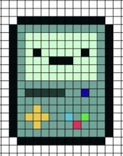

# Proyecto de Dibujo de Pixel Art con CSS Grid

¡Bienvenido al proyecto de Representación de Dibujo Pixel Art usando CSS Grid! Este proyecto fue desarrollado como parte del Curso Profesional de CSS Grid Layout en Platzi, con el objetivo de practicar y aplicar los conocimientos adquiridos en el curso. El proyecto consiste en una página web que utiliza CSS Grid para representar un modelo de cuadrícula como Pixel Art.

Puedes acceder a la página web en vivo aquí y al repositorio de GitHub aquí.

# Características

- Utilización de CSS Grid para crear una cuadrícula que representa un modelo de Pixel Art.
- Cada celda de la cuadrícula es representada visualmente utilizando CSS para simular un pixel.
- Diseño responsivo que se adapta a diferentes dispositivos y tamaños de pantalla.
- Representación fiel del modelo de cuadrícula utilizando los principios de CSS Grid.

# Modelo

 